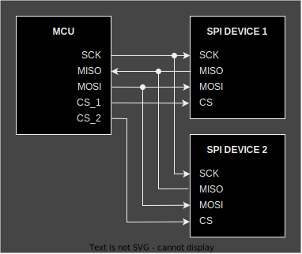

+++
title = "embedded-hal v1.0 now released!"
date = 2023-12-28
draft = false
in_search_index = true
template = "page.html"
+++

The Rust Embedded Working Group is proud to announce the release of `embedded-hal` version 1.0 together with the
companion crates `embedded-hal-bus`, `embedded-hal-async` and `embedded-hal-nb`.

Check out the [repository](https://github.com/rust-embedded/embedded-hal), the [API documentation](https://github.com/rust-embedded/embedded-hal#crates) and the [migration guide](https://github.com/rust-embedded/embedded-hal/blob/master/docs/migrating-from-0.2-to-1.0.md).

The `embedded-hal` crates provide traits (interfaces) for using peripherals commonly available in microcontrollers
such as GPIO, UART, SPI or I2C. They allow writing drivers (for sensors, displays, actuators, network adapters, etc.) in
a generic way, so they work on any microcontroller with an `embedded-hal` implementation without
modifying them. It's a central piece of the Embedded Rust ecosystem, ensuring interoperability throughout.

The 1.0 release has been in the works since 2020. Now that it's out, we consider all
traits in it to be *stable*. The plan is to extend `embedded-hal` with more traits in future 1.x releases,
not doing more breaking changes (i.e. there are no plans for a 2.0 release). This will provide a stable
base for building HALs and drivers.

So, what's new in `embedded-hal` 1.0?

<!-- more -->

## Focus on drivers

Previous versions of `embedded-hal` had a dual goal of standardizing HAL APIs for end users, and allowing writing generic drivers. 
Experience has shown that these goals sometimes conflict with each other. As the latter brings much more value, 1.0 focuses on that.

We've simplified some traits and merged others to remove interoperability gotchas.

We've removed traits that were found to not be usable for generic drivers (most notably timers). The plan is to add
them back in the future, with a better design. See the [migration guide](https://github.com/rust-embedded/embedded-hal/blob/master/docs/migrating-from-0.2-to-1.0.md) for details and links to the tracking issues.

## Async

A new addition is the `embedded-hal-async` crate, containing async versions of the traits. With today's Rust 1.75 release,
async traits are available on Rust stable. They can be used without heap allocations or dynamic
dispatch (unlike previous macro-based polyfills like the `async-trait` crate), so they are a great fit for bare-metal embedded usage.

Most `embedded-hal-async` traits are async versions of their blocking counterparts.

However, one highlight is the [`digital::Wait`](https://docs.rs/embedded-hal-async/1.0.0/embedded_hal_async/digital/trait.Wait.html) trait, with methods like `wait_for_high()` and `wait_for_low()`. This trait adds support for using "IRQ" GPIO pins typically used by SPI and I2C devices to send an interrupt to the microcontroller. This frequently-requested feature turned out to be hard to abstract with traits, but is now feasible in an ergonomic way with async.

## SPI bus sharing

The [`SpiDevice`](https://docs.rs/embedded-hal/1.0.0/embedded_hal/spi/index.html) trait now allows sharing a SPI bus between multiple devices, each selected with its own CS pin. The design allows for unrelated drivers to talk to different devices in the same bus without conflicts and without being aware of each other. 

The trait is agnostic about the kind of mutex/locking mechanism. The [`embedded-hal-bus`](https://docs.rs/embedded-hal-bus/0.1.0/embedded_hal_bus/spi/index.html) crate provides implementations for commonly used mutexes, but it is possible to write your own for e.g. the mutex of your favourite RTOS.

## Error handling

Generic drivers can now inspect errors, thanks to them being required to implement an `Error` trait
that allows querying the error "kind" out of a pre-selected set. HAL implementations can still use custom error types,
and map errors that don't fit in these categories to the `Other` kind.

All error types are also required to implement `Debug`, so `.unwrap()` and similar are now always available in generic drivers.

## embedded-io

The `embedded-hal` project also hosts the `embedded-io` crates. They provide traits for byte-oriented I/O streams. Since serial
ports (UART) are essentially byte streams, the serial-specific traits in `embedded-hal` have been removed in favor of `embedded-io`.

`embedded-io` has not reached 1.0 yet, but we expect that to happen in 2024.

## Thanks

Thanks to the HAL team ([@therealprof](https://github.com/therealprof), [@ryankurte](https://github.com/ryankurte), [@eldruin](https://github.com/eldruin), [@dirbaio](https://github.com/Dirbaio), [@MabezDev](https://github.com/MabezDev)), and to everyone who helped with testing, feedback and contributions for making `embedded-hal` 1.0 possible.

Thanks to the Rust Foundation for sponsoring Dario Nieuwenhuis ([@dirbaio](https://github.com/Dirbaio))'s work on `embedded-hal` through the [Fellowship grants program](https://foundation.rust-lang.org/news/announcing-the-rust-foundation-s-2023-fellows/).

And lastly, thanks to all the people releasing and maintaining HAL implementations and drivers using `embedded-hal`. *You* are the ones who make `embedded-hal` actually useful in the real world!
